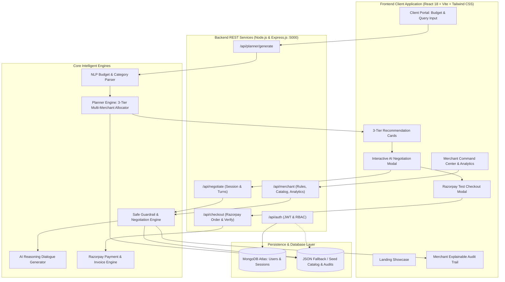

# DealPilot AI 🛍️🤖 — Complete Technical Documentation
### Smart Budget Planning & Safe Agentic Commerce Platform
**AI Growth & Agentic Commerce Hackathon**

> *"AI negotiates, but never without rules."*

---

## 🌟 Executive Summary

**DealPilot AI** is an intelligent e-commerce shopping and negotiation agent built to solve the dual challenges of consumer budget constraints and merchant cart abandonment.

In traditional e-commerce, fixed-budget shoppers face tedious manual comparisons, and when their ideal items exceed their budget, they abandon their carts. Conversely, merchants cannot afford to offer unchecked discounts without risking profit margins or exposing themselves to hallucinated AI pricing.

DealPilot AI bridges this gap through a **dual-portal agentic commerce platform**:
* **For Shoppers:** A natural language budget planner that generates three transparent, optimized shopping plans (💎 Best Quality, ⚖️ Best Value, 💰 Budget Saver) and provides an interactive, multi-round **Safe AI Negotiation Layer** to close budget gaps.
* **For Merchants:** A **Command Center** with deterministic guardrail controls (percentage caps, rupee caps, margin floors, round limits) and a **100% Explainable Audit Trail** guaranteeing that no AI offer ever breaches merchant profitability.

---

## 📚 Documentation Hub

For in-depth guides and technical details, see the [`docs/`](./docs) directory:

- 🏗️ [**System Architecture & Guardrail Mathematics**](./docs/ARCHITECTURE.md)
- 📡 [**Complete API Reference**](./docs/API_REFERENCE.md)
- 🛡️ [**Merchant Guardrails & Audit Trail**](./docs/MERCHANT_GUARDRAILS.md)
- 🛍️ [**Client & Shopper Experience Guide**](./docs/CLIENT_GUIDE.md)
- 🚀 [**Deployment, Environment & Testing Guide**](./docs/DEPLOYMENT_AND_TESTING.md)

---

## 🏗️ High-Level System Architecture



---

## 🛡️ Core Mathematical Guardrails & Safety Engine

The core differentiator of DealPilot AI is its **authoritative, server-enforced safety architecture** ([`server/services/negotiationEngine.js`](./server/services/negotiationEngine.js)). The AI cannot hallucinate prices or concede beyond deterministic boundaries.

### 1. The Three Hard Mathematical Guardrails
Whenever a customer proposes a counter-offer or clicks **"Negotiate Budget Gap"**, the engine evaluates the transaction against three strict mathematical rules:

* **Percentage Cap:**
  $$\text{Max Allowed by Percent} = \frac{\text{Original Price} \times \text{Policy Max Discount \%}}{100}$$

* **Rupee Cap:**
  $$\text{Max Allowed by Amount} = \text{Policy Fixed Rupee Cap (e.g. ₹500)}$$

* **Minimum Margin Floor:**
  $$\text{Minimum Safe Price} = \left\lceil \frac{\text{Wholesale Cost}}{1 - (\text{Policy Min Profit Margin \%} / 100)} \right\rceil$$

  $$\text{Max Discount Allowed by Margin} = \max(0, \text{Original Price} - \text{Minimum Safe Price})$$

### 2. Effective Maximum Discount & Clamping
The engine establishes the absolute ceiling for concessions:

$$\text{Effective Max Discount} = \min(\text{Max Allowed by Percent}, \text{Max Allowed by Amount}, \text{Max Discount Allowed by Margin})$$

If a customer's bid demands a discount greater than the allowable limit, the system clamps the offer to the minimum safe price, assigns a verdict (`COUNTER_OFFER_CLAMPED` or `FINAL_OFFER_CLAMPED`), and provides an explanatory rationale.

### 3. Progressive Multi-Round Concession Curve
Negotiation occurs over bounded rounds (default: 2 or 3 rounds maximum):
* **Round 1:** Offers an initial concession (~55% of the allowable maximum discount).
* **Round 2:** Steps closer (~82% of the allowable maximum discount).
* **Final Round:** Grants up to 100% of the allowable discount ceiling. Further counter-offers are hard-locked.

### 4. Smart Substitutions & Bonus Bundle Perks
* **Intelligent Item Swapping:** If a plan cannot reach the target budget through direct discounts alone without violating margin floors, the engine suggests swapping an expensive component for a high-value alternative (e.g., swapping a ₹2,800 headphone for a ₹2,400 boAt Rockerz) to hit the exact target.
* **Perk Incentives:** For orders meeting threshold limits (e.g., above ₹3,500), complimentary perks (like a *Braided Cable Organizer* or *Desk Mat*) are unlocked.

### 5. Zero Data Leakage Privacy Guarantee
All wholesale costs, cost prices, profit margins, and internal rule formulas are authoritatively isolated on the backend. The client network response payload contains only client-facing prices, savings, and perks.

---

## 💎 The 3-Tier Shopping Planner

Implemented in [`server/services/plannerService.js`](./server/services/plannerService.js), the planner parses natural language queries (e.g., *"I have ₹5,000 and need a keyboard, mouse, and headphones"*) and compiles three distinct tiers:

| Tier | Badge | Strategy & Selection Criteria | Typical Outcome |
| :--- | :--- | :--- | :--- |
| **Tier 1: Best Quality** | 💎 Premium Choice | Ranks products by highest build specs, tier ratings ($\ge 4.7$), mechanical switches, or studio-grade audio. Can be slightly above budget. | Perfect candidate for AI negotiation to bring down price. |
| **Tier 2: Best Value** | ⚖️ Best Value | Optimizes the specification-to-price ratio. Maximizes features right at the budget target. | Ready for instant 1-click checkout within budget. |
| **Tier 3: Budget Saver** | 💰 Budget Saver | Lowest price that still satisfies durability/quality thresholds (filters out sub-standard items). | Leaves extra cash in the user's pocket. |

---

## 🔍 100% Explainable Merchant Audit Trail

Located in [`client/src/components/AuditTrailViewer.jsx`](./client/src/components/AuditTrailViewer.jsx) and backed by [`server/services/negotiationEngine.js`](./server/services/negotiationEngine.js), every single negotiation round produces a cryptographically timestamped audit entry containing:

```json
{
  "id": "audit-1757064821000-482",
  "timestamp": "2026-09-05T14:30:00.000Z",
  "customer": "Alex Rivera",
  "merchantName": "OmniTech Solutions",
  "originalTotal": 5700,
  "customerBudget": 5000,
  "customerOffer": 4800,
  "negotiationRound": 1,
  "aiProposedDiscount": 500,
  "aiProposedPrice": 5200,
  "wholesaleCost": 3900,
  "finalMarginPercent": 25.0,
  "ruleChecks": {
    "maxDiscountPercent": { "limit": "10%", "value": "8.8%", "passed": true },
    "maxDiscountAmount": { "limit": "₹500", "value": "₹500", "passed": true },
    "minProfitMargin": { "limit": "18%", "value": "25.0%", "passed": true },
    "maxRounds": { "limit": 2, "value": 1, "passed": true }
  },
  "verdict": "COUNTER_OFFER_CLAMPED",
  "explanation": "OmniTech Solutions policy (max 10%, ₹500 cap, min 18% margin) applied. Round 1/2 offering ₹5,200 (-₹500)."
}
```

---

## 💻 Tech Stack & Key Files

### Technology Stack
* **Frontend:** React 18, Vite, Tailwind CSS, Lucide Icons, Chart.js, `react-chartjs-2`, `canvas-confetti`.
* **Backend:** Node.js (ES Modules), Express.js.
* **Database & Persistence:** MongoDB Atlas with Mongoose (`server/db.js`), plus an automated JSON fallback engine for offline development.
* **Security & Auth:** JWT tokens (`jsonwebtoken`), `bcryptjs` password hashing, role-based access control (`client` vs `merchant`).
* **Payments:** Razorpay Node.js SDK with signature verification (`crypto` HMAC SHA256) and automated PDF-ready tax invoices.

### Project Layout
```
dealPilot-Ai/
├── client/                                # React 18 + Vite Frontend
│   ├── src/
│   │   ├── components/
│   │   │   ├── auth/                      # Client & Merchant Logins, Role Select Modal
│   │   │   ├── client/                    # Client Portal, Marketplace Discovery, Deals, Alerts
│   │   │   ├── merchant/                  # Merchant Overview, Analytics, Guardrails, Orders, Catalog
│   │   │   ├── landing/                   # High-converting Landing Page & Showcase
│   │   │   ├── NegotiationModal.jsx       # Interactive AI Negotiation Interface
│   │   │   ├── CheckoutModal.jsx          # Razorpay Payment & Tax Invoice
│   │   │   ├── AuditTrailViewer.jsx       # Explainable Rule Verdicts Viewer
│   │   │   ├── PlanComparison.jsx         # 3-Tier Plan Comparison Cards
│   │   │   └── DemoPresets.jsx            # 1-Click Judging Scenarios
│   │   ├── services/api.js                # API Client
│   │   └── App.jsx                        # Central Router & State Management
├── server/                                # Node.js + Express Backend
│   ├── data/
│   │   ├── catalog.json                   # 40+ Peripherals & Electronics Catalog
│   │   ├── merchants.json                 # Verified Multi-Merchant Directory
│   │   ├── merchantRules.json             # Live Store Guardrails Configuration
│   │   └── auditLog.json                  # Explainable Audit Trail Records
│   ├── models/
│   │   └── User.js                        # User Schema & Auth Service (Mongo + Fallback)
│   ├── routes/
│   │   ├── auth.js                        # Auth Endpoints (Register, Login, Me)
│   │   ├── planner.js                     # 3-Tier Generation Route
│   │   ├── negotiate.js                   # Negotiation Session & Turn Handlers
│   │   ├── merchant.js                    # Guardrails, Analytics, Catalog CRUD
│   │   └── checkout.js                    # Razorpay Order Creation & Verification
│   ├── services/
│   │   ├── negotiationEngine.js           # Deterministic Guardrails & Clamping Engine
│   │   ├── plannerService.js              # NLP Parser & 3-Tier Plan Generator
│   │   ├── paymentService.js              # Razorpay Integration & Order Management
│   │   └── aiService.js                   # Contextual Agent Dialogue Generator
│   ├── db.js                              # MongoDB Atlas Connection Handler
│   └── index.js                           # Express Entrypoint
├── docs/                                  # Modular In-Depth Documentation Hub
├── test-system.js                         # Core Logic & Guardrail Verification Suite
├── scratch/                               # Automated Test Suites (Auth & E2E Marketplace Flow)
├── start-dev.js                           # Concurrent Frontend & Backend Launcher
└── package.json                           # Root Scripts
```

---

## 📡 REST API Reference

### 1. Authentication (`/api/auth`)
* `POST /api/auth/register`: Register as `client` or `merchant` (with store name & merchant ID).
* `POST /api/auth/login`: Authenticate email/password; returns signed 7-day JWT.
* `GET /api/auth/me`: Verify JWT session and fetch user profile.

### 2. Planner Engine (`/api/planner`)
* `POST /api/planner/generate`: Accept `{ budget, categories, query }`. Parses natural language and returns the 3 recommendation tiers.

### 3. Safe AI Negotiation (`/api/negotiate`)
* `POST /api/negotiate/start`: Initialize a negotiation session bound to a chosen plan and merchant policy.
* `POST /api/negotiate/turn`: Submit `{ sessionId, customerOffer, customerMessage, swapItemId }`. Returns client-safe counter-offer, explanation, and perks without leaking merchant costs.

### 4. Merchant Command Center (`/api/merchant`)
* `GET /api/merchant/rules`: Retrieve active store guardrails.
* `PUT /api/merchant/rules`: Update guardrail parameters (Max Discount %, Rupee Cap, Min Margin %, Max Rounds, Perks).
* `GET /api/merchant/audit-trail`: Retrieve full explainability audit log.
* `GET /api/merchant/analytics`: Retrieve live financial metrics and Chart.js datasets.
* `GET/POST/PUT/DELETE /api/merchant/catalog`: Full inventory CRUD.

### 5. Checkout & Payments (`/api/checkout`)
* `POST /api/checkout/create-order`: Create a Razorpay test order.
* `POST /api/checkout/verify`: Verify payment signature and record completed order with tax invoice.

---

## 🧪 Testing & Verification

The codebase includes automated end-to-end verification suites:

### 1. System Logic & Mathematical Guardrails
```bash
node test-system.js
```
*Verifies NLP parsing, exact 3-tier generation (₹5,700 / ₹4,900 / ₹3,600), discount clamping to ₹500 cap, margin floor protection, and the round-limiter.*

### 2. Full-Stack Authentication & MongoDB Integration (26 Tests)
```bash
npm run test:auth
```
*Tests user registration, bcrypt hashing, JWT validation, and fallback mechanisms.*

### 3. E2E Marketplace Discovery & Single-Merchant Checkout (5 Steps)
```bash
npm run test:marketplace
```
*Verifies natural language discovery, single-merchant resolution, zero data leakage of costs, negotiation turns, and checkout creation.*

---

## 🚀 Quick Start & Demo Flow

### 1. Starting the Application
From the project root:
```bash
# Install all dependencies (root, server, and client)
npm run install:all

# Launch both frontend and backend concurrently
npm run dev
```
* **Frontend:** `http://localhost:5173`
* **Backend:** `http://localhost:5000`

### 2. Pre-Seeded Demo Accounts
For instant login testing:
* **Client Account:** `alex.client@dealpilot.ai` | Password: `demo1234`
* **Merchant Account:** `sarah.merchant@dealpilot.ai` | Password: `merchant1234`

### 3. Step-by-Step Demo Flow
1. Open `http://localhost:5173`.
2. Click **"Demo Scenarios"** and select **"The ₹5,000 Trio"** (Keyboard + Mouse + Headphones).
3. Observe the **3 plans**:
   * 💎 **Best Quality (₹5,700)** — Over budget by ₹700.
   * ⚖️ **Best Value (₹4,900)** — Within budget target.
   * 💰 **Budget Saver (₹3,600)** — Saves ₹1,400.
4. Click **"Negotiate Budget Gap"** on the Best Quality plan.
5. Offer **₹4,800**:
   * DealPilot enforces the merchant guardrail: clamps the discount to **₹500** (final price: **₹5,200**), maintaining a **25% profit margin**.
   * DealPilot proposes swapping the headphone to bring the bundle to **₹4,800** within budget.
   * DealPilot unlocks a **Complimentary Braided Cable Clip Set** perk!
6. Accept the deal and complete simulated **Razorpay Checkout**.
7. Navigate to the **Merchant Hub** and **Audit Trail** tabs to view the live financial metrics update and inspect the mathematical verdict breakdown.