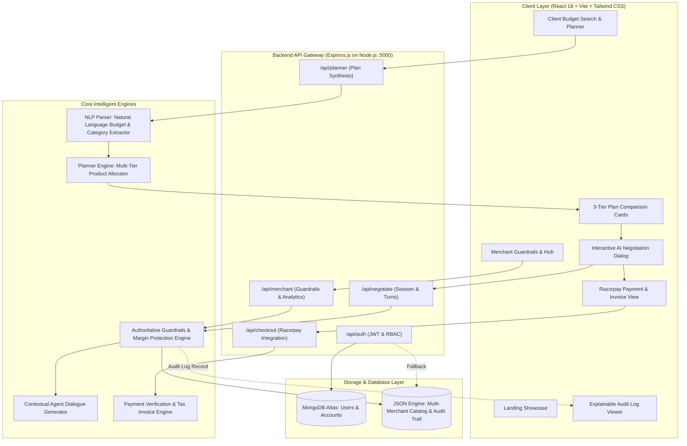

# DealPilot AI — System Architecture & Guardrail Mathematics 🏗️📐

This document provides a deep technical architectural overview of **DealPilot AI**, detailing the multi-tier recommendation engine, the deterministic guardrail safety architecture, pricing calculations, progressive negotiation stepping curves, and data protection boundaries.

---

## 1. High-Level System Architecture

DealPilot AI operates on a modern decoupled client-server architecture, with an authoritative server-enforced safety layer and a reactive user interface.

---

## 2. Component Breakdown

### 2.1. Client Presentation Layer (`client/`)
* **Technology:** React 18, Vite, Tailwind CSS, Lucide Icons, Chart.js (`react-chartjs-2`), Canvas Confetti.
* **Navigation & State:** Popstate-based URL routing (`/`, `/role-select`, `/client/login`, `/merchant/login`, `/client/dashboard`, `/merchant/dashboard`).
* **Session Management:** LocalStorage user persistence synchronized with server JWT verification on application startup (`/api/auth/me`).

### 2.2. Backend API Gateway (`server/`)
* **Technology:** Node.js (ES Modules), Express.js.
* **Middlewares:** CORS enabled, JSON body parser (10MB limit), Bearer token JWT authentication middleware (`authenticateToken`).
* **Database Driver:** Mongoose connecting to MongoDB Atlas with an automatic graceful local in-memory fallback.

---

## 3. Mathematical Formulation of Guardrails

The fundamental principle of DealPilot AI is that **an AI agent must never be permitted to set transaction prices unconstrained**. All negotiation steps are bounded by deterministic mathematics calculated inside [`server/services/negotiationEngine.js`](../server/services/negotiationEngine.js).

### 3.1. The Three Hard Mathematical Constraints

Given:
* $P_{\text{orig}}$ = Original listed retail price of the requested item or bundle
* $C_{\text{wholesale}}$ = Merchant wholesale acquisition cost
* $D_{\text{max}\%}$ = Merchant-configured maximum discount percentage (e.g. $10\%$)
* $D_{\text{cap}}$ = Merchant-configured maximum discount rupee amount (e.g. ₹500)
* $M_{\text{floor}}$ = Merchant-configured minimum profit margin percentage (e.g. $18\%$)

#### Rule 1: Percentage Discount Ceiling
$$D_{\text{percent}} = \frac{P_{\text{orig}} \times D_{\text{max}\%}}{100}$$

#### Rule 2: Fixed Rupee Discount Ceiling
$$D_{\text{amount}} = D_{\text{cap}}$$

#### Rule 3: Minimum Safe Price & Margin Ceiling
To protect against negative or sub-threshold margins, the minimum acceptable selling price $P_{\text{safe}}$ is derived from the margin definition:

$$\text{Margin} = \frac{P_{\text{safe}} - C_{\text{wholesale}}}{P_{\text{safe}}} \ge \frac{M_{\text{floor}}}{100}$$

Solving for $P_{\text{safe}}$:
$$P_{\text{safe}} = \left\lceil \frac{C_{\text{wholesale}}}{1 - (M_{\text{floor}} / 100)} \right\rceil$$

Thus, the maximum discount permitted before breaching the margin floor is:
$$D_{\text{margin}} = \max\left(0, P_{\text{orig}} - P_{\text{safe}}\right)$$

### 3.2. Effective Maximum Discount
The absolute concession limit for any negotiation involving this merchant and item is the strictest of all three constraints:

$$D_{\text{effective}} = \min\left(D_{\text{percent}}, D_{\text{amount}}, D_{\text{margin}}\right)$$

The minimum price to which the merchant can ever drop is:
$$P_{\text{min}} = P_{\text{orig}} - D_{\text{effective}}$$

---

## 4. Progressive Multi-Round Stepping Curve

DealPilot AI models real-world bargaining behavior through a **progressive concession curve** across configured negotiation rounds (default: 2 or 3 rounds). The agent does not immediately give away its full allowable concession in Round 1:

| Round ($r$) | Maximum Allowable Concession in Round | Rationale |
| :---: | :---: | :--- |
| **Round 1** | $D_{\text{round 1}} = \text{round}\left(D_{\text{effective}} \times 0.55\right)$ | Tests customer commitment; preserves merchant margin if user accepts early. |
| **Round 2** | $D_{\text{round 2}} = \text{round}\left(D_{\text{effective}} \times 0.82\right)$ | Steps closer to the user's budget gap while keeping a reserve. |
| **Final Round** | $D_{\text{final}} = D_{\text{effective}}$ | Offers the absolute limit ($P_{\text{min}}$). Locks the deal against further bargaining. |

If a customer bid $O_{\text{user}}$ satisfies $P_{\text{orig}} - O_{\text{user}} \le D_{\text{round}}$, the bid is accepted (`verdict: APPROVED`).
If $P_{\text{orig}} - O_{\text{user}} > D_{\text{round}}$, the offer is **clamped** to $P_{\text{orig}} - D_{\text{round}}$ (`verdict: COUNTER_OFFER_CLAMPED`).

---

## 5. Smart Item Substitutions & Value-Add Perks

When a customer's stated budget $B$ is lower than the minimum safe price $P_{\text{min}}$ ($B < P_{\text{min}}$), discounting alone cannot safely close the gap.

1. **Intelligent Substitution:**
   * The engine scans the catalog for compatible alternative items in the same product category with comparable review ratings ($\ge 4.4\star$) but a lower base wholesale cost.
   * Example: In the ₹5,000 Hero Demo, the ₹2,800 Audio-Technica headphones are proposed to be swapped with ₹2,400 boAt Rockerz 550, enabling the customer to reach **₹4,800** completely within budget.
2. **Bundle Perks:**
   * If the transaction subtotal exceeds the merchant's `bundlePerksThreshold` (default: ₹3,500), the system automatically adds complimentary zero-cost accessories (e.g. *Braided Cable Organizer Clip Set* or *Microfiber Cleaning Kit*), creating high perceived value without impacting cash margins.

---

## 6. Data Isolation & Zero Leakage Security Guarantee

A critical vulnerability in naive AI commerce implementations is leaking internal seller data to the buyer. DealPilot AI enforces strict separation between backend audit data and client payloads:

| Field | In Server Memory & Audit Trail | In Client API Network Response |
| :--- | :---: | :---: |
| `originalTotal` | ✅ | ✅ |
| `offeredPrice` | ✅ | ✅ |
| `discountAmount` | ✅ | ✅ |
| `perks` | ✅ | ✅ |
| `wholesaleCost` | ✅ | ❌ **Strictly Redacted** |
| `costPrice` | ✅ | ❌ **Strictly Redacted** |
| `profitMarginPercent` | ✅ | ❌ **Strictly Redacted** |
| `minProfitMarginPercent` | ✅ | ❌ **Strictly Redacted** |
| `ruleChecks` breakdown | ✅ (Merchant Only) | ❌ **Strictly Redacted** |

This guarantees that buyers cannot reverse-engineer merchant cost bases or calculate maximum bargaining headroom.
